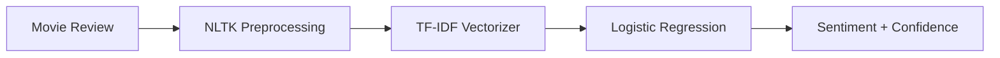

<p align="center"><sub>WEEK 09 · DAY 04 · PUBLIC DEPLOYMENT</sub></p>

<h1 align="center">CineSense</h1>

<p align="center">
  <strong>IMDb Sentiment Intelligence</strong><br>
  A polished Streamlit experience that classifies English movie reviews as
  positive or negative and reports the model's confidence.
</p>

<p align="center">
  <a href="https://asma-movie-sentiment.streamlit.app"><strong>Launch the Live App →</strong></a>
</p>

> [!NOTE]
> **Deployment status: Live** — The application is publicly available on
> Streamlit Community Cloud.

## Overview

CineSense turns a written movie review into a sentiment prediction using the
same preprocessing and trained artifacts developed during Week 9:



The application keeps inference consistent with training by applying HTML
cleanup, tokenization, stop-word handling, POS-aware lemmatization, and the
fitted TF-IDF vocabulary before classification.

## Live deployment

| Item | Configuration |
|---|---|
| Platform | Streamlit Community Cloud |
| Repository | `assma122/Binx-ai-ml-training` |
| Branch | `main` |
| Entry point | `Week9/Day4/app.py` |
| Public URL | [asma-movie-sentiment.streamlit.app](https://asma-movie-sentiment.streamlit.app) |
| Status | **Live** |

## Validation results

The deployed app was tested using the same representative inputs as the local
application.

| Test | Local result | Live result | Match |
|---|---:|---:|:---:|
| Positive example | Positive | Positive · 97.68% | ✓ |
| Negative example | Negative | Negative · 98.66% | ✓ |
| `It was okay.` | Negative | Negative · 89.92% | ✓ |
| Invalid input: `a` | Validation warning | Validation warning | ✓ |

The short neutral-sounding review is classified as negative in both
environments. This is a model behavior rather than a deployment difference.

## Project structure

```text
Week9/Day4/
├── app.py                  # Streamlit interface, preprocessing, and inference
├── model.joblib            # Trained Logistic Regression classifier
├── vectorizer.joblib       # Fitted TF-IDF vectorizer
├── requirements.txt        # Pinned deployment dependencies
├── Week9_Day4.ipynb        # Deployment process and validation evidence
└── README.md               # Project documentation
```

## Run locally

From the repository root:

```powershell
conda activate binx-ai
python -m pip install -r Week9/Day4/requirements.txt
python -m streamlit run Week9/Day4/app.py
```

Then open `http://localhost:8501` and test a review.

## Reproducible deployment

- Dependencies are pinned in `requirements.txt`.
- `model.joblib` and `vectorizer.joblib` are loaded through relative paths.
- The deployed app reuses the exact training preprocessing.
- Positive, negative, short, and invalid inputs are validated.
- Live outputs match the local application behavior.

## Tech stack

| Layer | Technology |
|---|---|
| Interface | Streamlit |
| Text preprocessing | NLTK |
| Feature extraction | TF-IDF |
| Classifier | Logistic Regression |
| Artifact loading | Joblib |
| Hosting | Streamlit Community Cloud |

---

<p align="center">
  Designed and deployed by <strong>Asma Bzoor</strong><br>
  Machine Learning Training · Week 9
</p>
