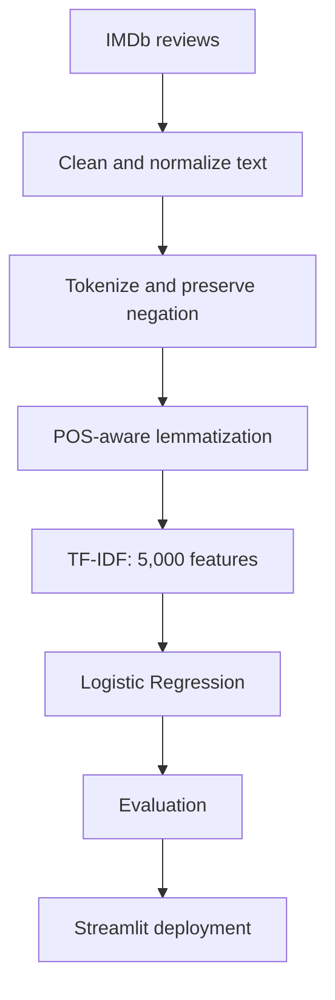
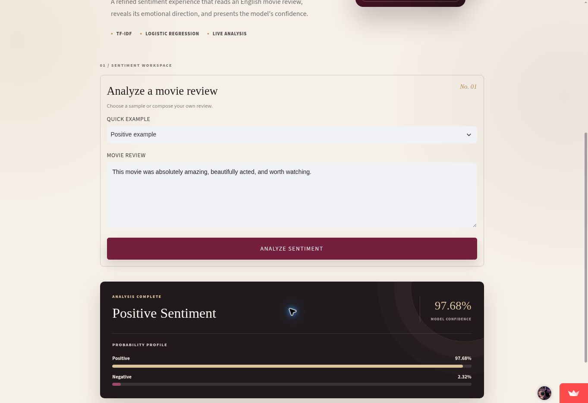

<p align="center"><sub>WEEK 09 · DAY 05 · FINAL PROJECT CLOSE-OUT</sub></p>

<h1 align="center">CineSense</h1>

<p align="center">
  <strong>IMDb Sentiment Intelligence</strong><br>
  An end-to-end machine-learning application that turns an English movie review
  into a positive or negative sentiment prediction with model confidence.
</p>

<p align="center">
  <a href="https://asma-movie-sentiment.streamlit.app"><strong>Launch the Live App →</strong></a>
  &nbsp;·&nbsp;
  <a href="https://github.com/assma122/Binx-ai-ml-training"><strong>GitHub Repository</strong></a>
</p>

> [!IMPORTANT]
> **Project status: complete and publicly deployed.** The production application
> is available at [asma-movie-sentiment.streamlit.app](https://asma-movie-sentiment.streamlit.app).

## Project at a glance

| Item | Result |
|---|---|
| Task | Binary sentiment classification |
| Dataset | IMDb movie reviews |
| Unique records | 49,582 |
| Model | Logistic Regression |
| Features | TF-IDF, maximum 5,000 features |
| Test records | 9,917 |
| Accuracy | **88.62%** |
| F1-score | **88.79%** |
| Deployment | Streamlit Community Cloud |

## Problem statement

Movie platforms receive large volumes of written reviews that are difficult to
inspect manually. CineSense automates the first stage of review analysis by
classifying each English review as **positive** or **negative**. The application
also exposes the predicted probabilities so users can see how confident the
model is rather than receiving an unexplained label.

## Dataset

The project uses the IMDb movie review dataset with two fields: the review text
and its sentiment label. After duplicate removal, the working dataset contains
**49,582 unique reviews**. Labels are mapped as follows:

- `negative → 0`
- `positive → 1`

A stratified 80/20 split with `random_state=42` produces **39,665 training** and
**9,917 testing** examples while preserving the class distribution.

## Methodology



The preprocessing pipeline performs HTML cleanup, contraction normalization,
lowercasing, number and punctuation removal, tokenization, stop-word removal
while preserving `not`, `no`, and `nor`, POS tagging, and WordNet
lemmatization. The fitted TF-IDF vectorizer and trained classifier are stored as
Joblib artifacts and reused unchanged during inference.

## Evaluation results

The final model was evaluated on the untouched stratified test set.

| Metric | Score | Acceptance benchmark | Status |
|---|---:|---:|:---:|
| Accuracy | **88.62%** | ≥ 85% | Passed |
| Precision | **87.76%** | — | Documented |
| Recall | **89.85%** | — | Documented |
| F1-score | **88.79%** | ≥ 85% | Passed |

### Confusion matrix

| Actual / Predicted | Negative | Positive |
|---|---:|---:|
| Negative | **4,316** | 624 |
| Positive | 505 | **4,472** |

The model correctly classified **8,788 of 9,917** reviews. Positive recall is
89.85%, meaning it identified most positive reviews, while 505 positive reviews
were missed. The close accuracy and F1 values indicate stable performance on
this nearly balanced dataset.

## Live application



| Deployment item | Configuration |
|---|---|
| Platform | Streamlit Community Cloud |
| Repository | `assma122/Binx-ai-ml-training` |
| Branch | `main` |
| Entry point | `Week9/Day4/app.py` |
| Public URL | [asma-movie-sentiment.streamlit.app](https://asma-movie-sentiment.streamlit.app) |
| Status | **Live** |

Representative positive, negative, short, and invalid inputs were tested on
both local and deployed versions. All outputs matched.

## Repository structure

```text
Week9/
├── Day1/                         # Data preparation, TF-IDF, model training
├── Day2/                         # FastAPI model service
├── Day3/                         # Streamlit interface development
├── Day4/                         # Public deployment
│   ├── app.py
│   ├── model.joblib
│   ├── vectorizer.joblib
│   ├── requirements.txt
│   └── Week9_Day4.ipynb
└── Day5/                         # Final project close-out
    ├── Week9_Day5.ipynb
    ├── README.md
    ├── TECHNICAL_WRITEUP.md
    ├── DEFINITION_OF_DONE.md
    ├── SPRINT_REVIEW_RETROSPECTIVE.md
    ├── experiments/experiment_log.csv
    ├── results/model_metrics.json
    └── assets/cinesense_live_result.jpg
```

## Run locally

From the repository root in PowerShell:

```powershell
conda activate binx-ai
python -m pip install -r Week9/Day4/requirements.txt
python -m streamlit run Week9/Day4/app.py
```

Open `http://localhost:8501`, enter an English movie review, and select
**Analyze Sentiment**.

## Reproducibility

- The train/test split is stratified and fixed with `random_state=42`.
- The TF-IDF vocabulary is capped at 5,000 features.
- The Logistic Regression model uses `max_iter=1000` and `random_state=42`.
- Deployment dependencies are pinned in `Week9/Day4/requirements.txt`.
- The serialized model and vectorizer are loaded through relative paths.
- The experiment configuration and results are recorded in
  `experiments/experiment_log.csv`.

## Limitations

- The classifier supports English movie reviews only.
- Every valid review must become positive or negative; there is no neutral
  class.
- TF-IDF does not fully represent word order, sarcasm, or long-range context.
- Predictions may be less reliable for text unlike the IMDb training domain.
- Displayed probabilities are model estimates and are not a guarantee of
  correctness.

## Future work

- Add a neutral or mixed-sentiment class.
- Compare the classical baseline with a transformer-based model.
- Calibrate probabilities and select thresholds using validation data.
- Add drift monitoring and anonymous user feedback.
- Package automated tests and continuous deployment checks.

## Project documentation

- [Technical write-up](TECHNICAL_WRITEUP.md)
- [Definition of Done](DEFINITION_OF_DONE.md)
- [Sprint Review and retrospective](SPRINT_REVIEW_RETROSPECTIVE.md)
- [Experiment log](experiments/experiment_log.csv)
- [Machine-readable metrics](results/model_metrics.json)

---

<p align="center">
  Designed, developed, evaluated, and deployed by <strong>Asma Bzoor</strong><br>
  BinX Machine Learning Training · Week 9
</p>
